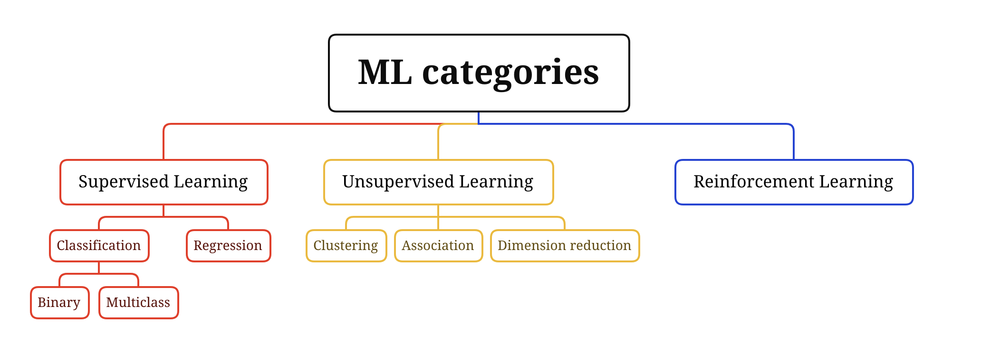
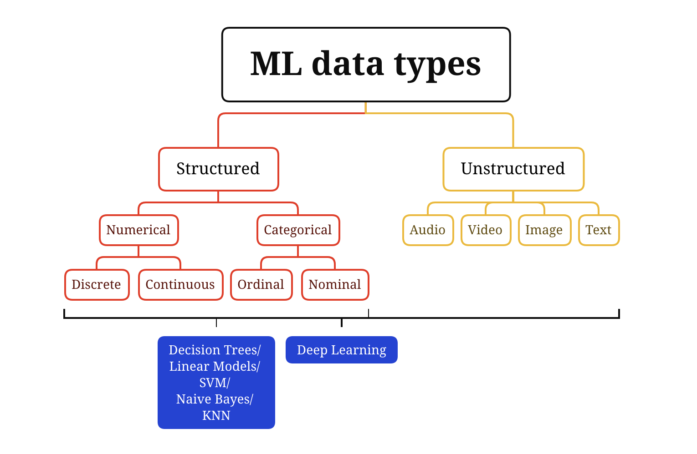

- [1. Clarifying requirements](#1-clarifying-requirements)
  - [business objective](#business-objective)
  - [features the system needs to support](#features-the-system-needs-to-support)
  - [data](#data)
  - [constraints](#constraints)
  - [scale of the system](#scale-of-the-system)
  - [performance](#performance)
- [2. Framing the problem as an ML task](#2-framing-the-problem-as-an-ml-task)
  - [Defining the ML objective](#defining-the-ml-objective)
  - [Specifying the system's input and output](#specifying-the-systems-input-and-output)
  - [Choosing the right ML category](#choosing-the-right-ml-category)
    - [Common ML categories](#common-ml-categories)
- [3. Data preparation](#3-data-preparation)
  - [Data engineering](#data-engineering)
    - [Data source](#data-source)
    - [Data storage (database)](#data-storage-database)
    - [Extract, transform, and load (ETL)](#extract-transform-and-load-etl)
    - [Data types in ML](#data-types-in-ml)
  - [Feature engineering](#feature-engineering)
    - [Operations](#operations)
      - [Missing values](#missing-values)
      - [Feature Scaling](#feature-scaling)
      - [Discretization](#discretization)
      - [Encoding categorical features](#encoding-categorical-features)
        - [integer encoding](#integer-encoding)
        - [one-hot encoding](#one-hot-encoding)
      - [embedding learning](#embedding-learning)
- [4. Model development](#4-model-development)
- [5. Evaluation](#5-evaluation)
- [6. Deployment and serving](#6-deployment-and-serving)
- [7. Monitoring and infrastructure](#7-monitoring-and-infrastructure)
## 1. Clarifying requirements

Ensure everyone is on the same page.

### business objective

e.g., create a system to recommend vacation rentals (increase the bookings/ increase the revenue)

### features the system needs to support

e.g., a video recommendation system (want to know if users can like or dislike recommended videos) -> used to label training data

### data

- data sources?
- data size?
- data labeled?

### constraints

- available computer power 
- cloud-based/ local-based

### scale of the system

- number of users
- number of items that are needed to deal

### performance

- prediction speed
- real-time/ off-line solution

## 2. Framing the problem as an ML task

Determine if ML is necessary for solving a given problem first.

### Defining the ML objective

- Translate the business objective into a well-defined ML objective. (some examples on Page 4)

### Specifying the system's input and output

- specify input and output for each model
- might be multiple ways to specify each model's input-output

### Choosing the right ML category

#### Common ML categories

## 3. Data preparation

### Data engineering

#### Data source

- who collect the data
- is data clean?
- trusted data source?
- user-generated or system-generated data

#### Data storage (database)

- SQL (relational)
- NoSQL

#### Extract, transform, and load (ETL)

- extract: extract data from different data sources
- transform: cleansed, mapped, transformed into specific format to meet operational needs
- load: loaded into target destination

#### Data types in ML

### Feature engineering

- Select and extract predictive features from raw data
- Transform predictive features into a format usable by the model

#### Operations

Refer to Page 10

##### Missing values

- Deletion
- Imputation
  - fill with default
  - fill with mean, median, or mode

##### Feature Scaling

Scaling features to have a standard range and distribution

- Normalization (min-max scaling) [do not change data distribution]
- Standardization (z-score normalization)
- Log scaling [mitigate the skewness of a feature/ converge faster during optimization]

##### Discretization

Converting a continuous feature into a categorical feature.

##### Encoding categorical features

###### integer encoding

- assign an integer value to each unique category value
- useful if  ordinal relationship exists between categorical features

###### one-hot encoding

- create a binary feature for each unique value

##### embedding learning

- learning an N-dimensional vector for each unique value that the categorical feature may take
- useful when the number of unique values is very large (one-hot may lead to large vector sizes)

## 4. Model development

## 5. Evaluation

## 6. Deployment and serving

## 7. Monitoring and infrastructure

